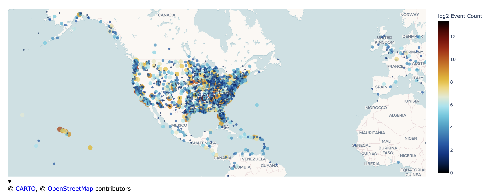
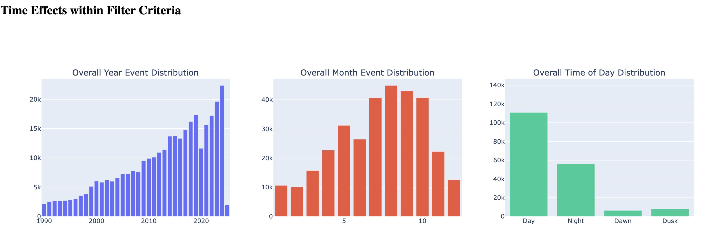
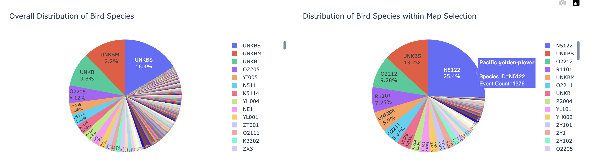

# birdstrikes
An analytic dashboard to explore FAA bird strikes.

## install

The recommended practice is to create a new virtual environment using your host python. 

For a Mac/Linux, this may look like

```bash
python3.11 -m venv env
source env/bin/activate
pip install requirements.txt
```

Python 3.11 was used in testing but should work starting at 3.10. 

## setup

The dashboard is a Flask app implemented with dash and plotly. To use the app, a command line interface, you need to run the script from the terminal with an excel/csv file. 

```bash
source env/bin/activate # if not already activated
python -m birdstrikes.explore Public.xlsx
```

and then navigate to the mentioned host, which should be `http://127.0.0.1:8050/`

## App Features

The dash app is meant to provide a frontend visualization to the FAA dataset downloaded at https://wildlife.faa.gov/search. All visualizations are cross-linked to an extent. For example, selecting points on the map will update the data used in plots. Likewise, applying a time or aircraft filter will update plots. The interactivity and cross linking is meant to accelerate exploration.  

### Filtering and Selection

A user can select a date range to explore and or an aircraft to display. By default, date range is the earliest and latest time point, and selected aircraft is all. 


### Geographic Effects

Points on a map are produced by using the airport latitude and longitude of a bird strike event. The points are sized and colored proportionally to the count. The count is log_2 transformed to aid relative differences across the frequency spectrum. 



### Time Effects

A basic time effect vignette is included. By default the overall count distribution by year, month, and time of day is shown. An additional row of plots are added if a user selects points on the map. The original plots are included for comparison to a selected area. 



### Distribution Analysis of Event Variables

A handful of marginal distributions are included. These were selected out of curiosity but could be refined for a specific use case. Some example analysis uses are: 
1. Identifying bird species that are specific to a geographic area of interest
2. Surveying damage effects by an airframe, and or geographic area. 
3. Seasonal bird strike effects within a geographic area of interest

Post selection of Hawaii islands that shows the Pacific Golden Glover as the most frequent struck bird. 

